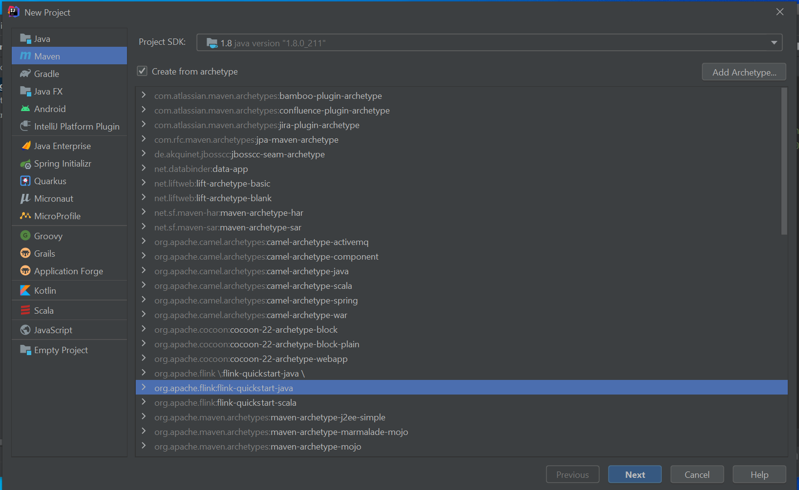
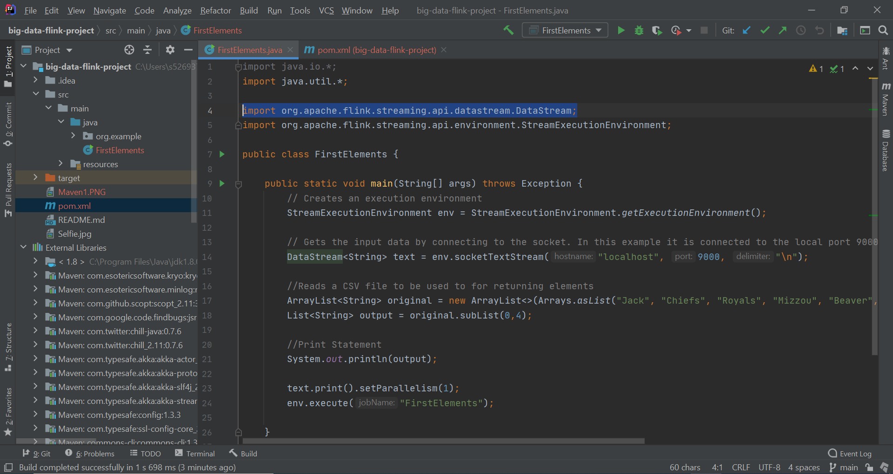
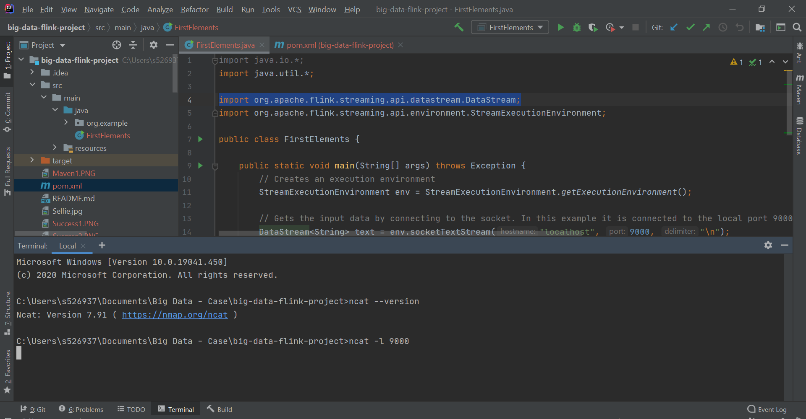

# big-data-flink-project

## Author
[Jack W Beaver](https://github.com/JackWBeaver) <br>


## Tools
- IntelliJ
- Git Bash
- NetCat

## Introduction to Flink
- Flink is an open-source, unified stream-processing and batch processing framework. It was developed by the Apache Software Foundation.
- A distributed streaming data-flow engine written in Java and Scala.
- Executes arbitrary dataflow programs in a data-parallel and pipelined manner.

## Prerequisites
Start by cloning the Apache Flink repository with Git Bash in C: drive:
```Git Bash
git clone https://github.com/apache/flink.git
```
Next, import your project and configure your settings as described in the following URL: (**Note:** Building your project in IntelliJ could take awhile, so just wait while it adds all files.) <br>  https://ci.apache.org/projects/flink/flink-docs-master/flinkDev/ide_setup.html#pycharm

Now you're ready to get started!

## Flink Set Up with Maven
Use IntelliJ to create a new Maven Project. When creating the project check the box next to "Create from archetype" then select ```org.apache.flink:flink-quickstart-java``` (see image below). Clink ```Next``` until you have created your project.


Check your ```pom.xml``` file to make sure that your dependencies dare in order, then you are ready to start writing code.

## Code to Execute Skill
Code for getting First n Elements (see image below to see full java file):
```Java
//Reads a CSV file to be used to for returning elements
ArrayList<String> original = new ArrayList<>(Arrays.asList("Jack", "Chiefs", "Royals", "Mizzou", "Beaver", "Big Data", "NWMSU", "KC", "USA"));
List<String> output = original.subList(0,4);

//Print Statement
System.out.println(output);
```


After running your java code, open up a terminal and run ```ncat -l 9000``` to run NetCat on a local terminal at port 9000. This will be your final result:



### References
- Source showing how to download IntelliJ and Flink: https://ci.apache.org/projects/flink/flink-docs-master/flinkDev/ide_setup.html#pycharm
- Source for setting up Flink Development Environment: https://cwiki.apache.org/confluence/display/FLINK/Setting+up+a+Flink+development+environment
- Repository cloned and used to download Flink: https://github.com/apache/flink
- Download Link for IntelliJ: https://www.jetbrains.com/idea/download/#section=windows
- Download Link for NetCat: https://nmap.org/download.html
